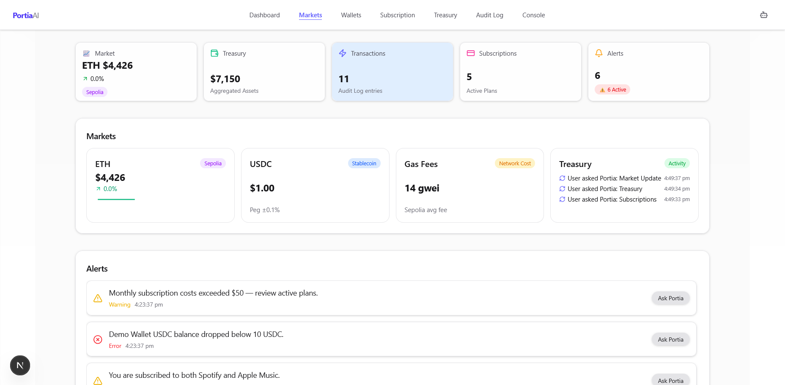
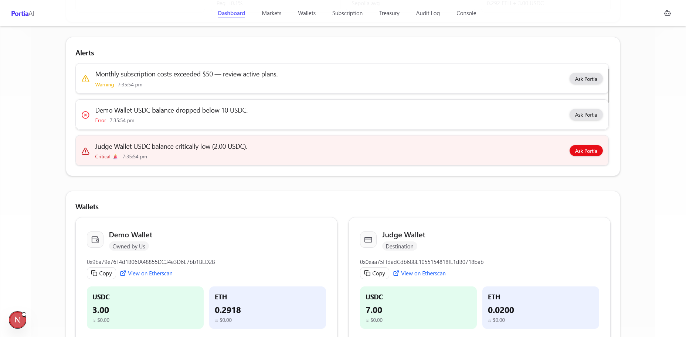
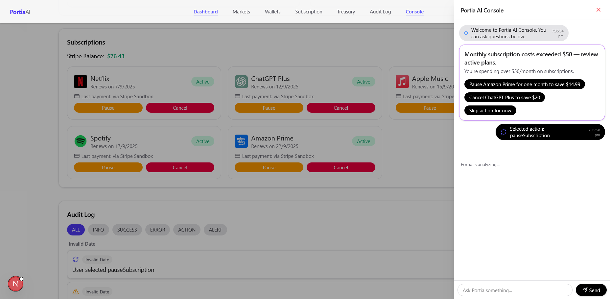

# Portia Finance Agent 

A full-stack **AI-powered finance dashboard** for managing wallets, subscriptions, and alerts with the help of **Portia AI**.  
Built with **Next.js 15 + Tailwind + shadcn/ui** on the frontend and **FastAPI + Python** on the backend.  

---

## 🤖 Tech Stack

### Frontend
- **Next.js 15** (App Router, React 19)
- **TailwindCSS 4**
- **shadcn/ui + Radix UI**
- **Framer Motion** (animations)
- **ethers.js v6** (crypto wallet integration)
- **Vercel** (hosting)

### Backend
- **FastAPI (Python 3.11)**  
- **httpx** (API calls to external services)  
- **Web3.py / ethers** (blockchain interaction)  
- **Render** (backend hosting)

---

## ⚙️ Features
- 🔐 **Wallet Manager** – Track balances (ETH + USDC Sepolia Testnet)  
- 💳 **Subscriptions Manager** – Pause, resume, cancel, and refund demo plans  
- ⚡ **Real-Time Alerts** – Market moves, low balances, subscriptions  
- 📝 **Audit Logs** – Every action logged for transparency  
- 🤖 **Portia AI Console** – Ask Portia about your wallets & subscriptions  

---
```
📂 Project Structure
├── backend/ # FastAPI backend (deployed on Render)
│ ├── main.py
│ ├── routes/
│ └── services/
│
├── frontend/ # Next.js frontend (deployed on Vercel)
│ ├── public/
│ ├── src/
│ │ ├── app/
│ │ │ ├── page.tsx
│ │ │ └── layout.tsx
│ │ ├── components/
│ │ └── lib/
│ └── package.json
│
├── .vercelignore
├── README.md
└── requirements.txt # backend Python deps
```

---

## 🔧 Local Development

### 1. Clone repo
```bash
git clone https://github.com/OscarK-coder/portia-finance-agent.git
cd portia-finance-agent
```
### 2. Backend (FastAPI)

```bash
cd backend
python -m venv .venv
source .venv/bin/activate    # (Linux/Mac)
.venv\Scripts\activate       # (Windows PowerShell)

pip install -r requirements.txt
uvicorn main:app --reload
```

##### API runs at: http://127.0.0.1:8000

### 3. Frontend (Next.js)
```bash
cd frontend
npm install
npm run dev
```

## 📦 Deployment

### 🔹 Backend
- **Platform**: [Render](https://render.com) 
- **Base URL**: [`https://portia-finance-agent.onrender.com/api`](https://portia-finance-agent.onrender.com/api)

### 🔹 Frontend
- **Platform**: [Vercel](https://vercel.com)  
- **Base URL**: [`https://portia-finance-agent.vercel.app`](https://portia-finance-agent.vercel.app) 

### 🌍 Environment Variables (Frontend)
Set the following in **Vercel → Project Settings → Environment Variables**:

```env
# Backend API
NEXT_PUBLIC_API_URL=https://portia-finance-agent.onrender.com/api
# Ethereum RPC (Sepolia Testnet)
NEXT_PUBLIC_RPC_URL=https://sepolia.infura.io/v3/YOUR_INFURA_KEY
# USDC Testnet Contract (Sepolia)
NEXT_PUBLIC_USDC_CONTRACT=YOUR_PUBLIC_KEY
```

## 🖼️ Screenshots

### Dashboard


### AI Console


### Subscriptions
